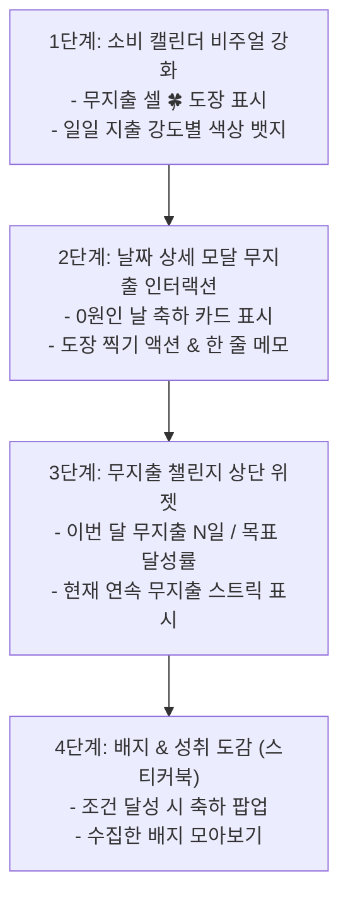

# [기획서] MyWallet 게임화(Gamification) 기능: 무지출 챌린지 & 소비 캘린더

> **문서 상태:** 초안 (Draft)  
> **작업 브랜치:** `agy_dev`  
> **개발 서버:** `http://localhost:5174`  
> **핵심 타깃:** 저빈도/소량 트랜잭션 환경에서 일일 접속 및 기록 재미를 극대화하는 마이크로 인터랙션

---

## 1. 앱 전체 현황 리뷰 (Architecture & Current State)

### 1.1 현재 데이터 및 화면 구조
- **장부/거래 엔진:**
  - `transactions` 테이블 및 SQLite(D1) 동기화 기반.
  - 일일/월간 지출 및 수입 집계는 `dateWiseSums[dateStr]` (`YYYY-MM-DD` 기준)을 통해 실시간 연산됨.
- **캘린더 탭 (`calendar` & `ledgerView === 'calendar'`):**
  - 현재 날짜 셀(`calendar-cell`)은 지출(`expense > 0`) 또는 수입(`income > 0`)이 있을 때만 단순 숫자 뱃지(`-15,000`, `+50,000`)를 렌더링함.
  - 지출/수입이 없는 날(0원)은 **완전한 빈칸**으로 표시됨.
  - 셀 클릭 시 `selectedDayData` 모달이 뜨지만, 거래가 없는 날은 단순히 *"해당 날짜에 등록된 거래 내역이 없습니다."*라는 정적 텍스트만 출력됨.
- **디자인/테마 환경:**
  - `html[data-style-theme="doodle"]` 손그림(Gaegu, Gowun Dodum 폰트) 감성과 부드러운 카드/패널 테두리.
  - 아날로그 다이어리, 손도장(스탬프), 스티커 인터랙션에 최적화된 시각적 토대 보유.

### 1.2 사용자 경험(UX) 페인포인트 분석
1. **역설적 방치 현상:**  
   돈을 쓰지 않은 '알뜰한 날'일수록 앱에 입력할 데이터가 없어서 앱을 켤 이유가 사라짐 ➔ 며칠 연속 방치되다가 가계부 작성 습관이 깨짐.
2. **단순 숫자 나열의 건조함:**  
   거래 건수가 적은 날(예: 하루 1건)은 달력이나 통계 차트에 큰 변화가 없어 시각적 성취감이 낮음.
3. **금융 원장 무결성 규칙(`.agents/AGENTS.md`):**  
   게임적인 요소를 추가하더라도 실제 금융 거래 데이터(`transactions`, `assets`, `revision`, `operationId`)를 오염시키거나 깨뜨려서는 안 됨.

---

## 2. 핵심 기능 상세 기획

---

### [기능 1] 비주얼 소비 캘린더 (Visual & Emotional Spending Calendar)

기존의 "숫자만 작게 적힌 달력"에서 **"하루의 소비 상태와 스토리가 한눈에 보이는 다이어리형 달력"**으로 진화합니다.

#### 1) 일일 소비 상태 비주얼 인디케이터 (Daily State Indicator)
매일의 지출 금액에 따라 캘린더 셀에 직관적이고 귀여운 두들 시각 요소를 자동 부여합니다.

| 일일 지출 상태 | 판정 조건 | 캘린더 셀 시각 표현 | 감성 메시지/도장 |
| :--- | :--- | :--- | :--- |
| **🍀 무지출일 (No-Spend)** | `expense === 0` (오늘 이전 또는 오늘) | 귀여운 손그림 클로버/도장 아이콘 | *"지갑 꿀잠 중!" / "0원 방어"* |
| **🟢 알뜰 소비 (Frugal)** | `0 < expense <= 일일 권장 예산` | 은은한 민트/그린 하이라이트 | *"알뜰한 하루"* |
| **🟡 일상 소비 (Normal)** | `일일 예산 < expense <= 예산 1.5배` | 기본 텍스트 뱃지 | 일상 지출 |
| **🔥 플렉스/주의 (Over)** | `expense > 예산 1.5배` 또는 큰 금액 | 불꽃(🔥) 마이크로 아이콘 | *"열정적인 소비!"* |

#### 2) 날짜 상세 팝업(`selectedDayData`)의 능동적 인터랙션
- 거래 내역이 없는 날을 클릭했을 때 정적 텍스트 대신 **성취 카드**를 노출:
  - 🎉 **"오늘 하루 지출 0원! 완벽하게 방어했습니다."**
  - **[오늘 무지출 도장 쾅 찍기!]** 버튼 제공 (수동 스탬프 인증 인터랙션).
  - 간단한 **"오늘의 한 줄 소비 소회"** (예: "점심 도시락 먹음", "쇼핑 욕구 참았다!") 마이크로 메모 입력 가능.

---

### [기능 2] 무지출 챌린지 & 스트릭 시스템 (No-Spend Challenge & Streak)

돈을 쓰지 않는 행위 자체를 **"매일 클리어하는 퀘스트"**로 게임화합니다.

#### 1) 월간 챌린지 목표 & 진행 게이지
- **목표 설정:** 이번 달 무지출 목표일 수 설정 (기본값: 월 7일 / 사용자 커스텀 가능: 5일, 10일, 15일).
- **캘린더 상단 미니 대시보드 위젯:**
  - `이번 달 무지출 달성: 🍀 6일 / 목표 10일 (60%)`
  - 귀여운 두들 프로그레스 바 + 목표 달성 시 트로피(🏆) 이펙트.

#### 2) 무지출 연속 스트릭 (Streak Engine)
- **개념:** 어제에 이어 오늘도 돈을 안 썼다면 연속 일수(Streak)가 누적됨 (예: `🔥 3일 연속 무지출 중!`).
- **도장 쾅! 손맛(Micro-Interaction):**
  - 오늘 무지출을 확정하거나 도장을 찍을 때, 화면에 잉크가 번지듯 쿵! 찍히는 햅틱/애니메이션 피드백.
  - 스트릭 유지 중에는 달력의 무지출 도장들이 체인 형태로 연결되는 시각적 보람 제공.

#### 3) 두들 성취 배지 (Badges & Stickers)
데이터가 적은 사용자도 며칠만 꾸준히 쓰면 획득할 수 있는 캐주얼 배지 시스템:
- 🥉 **첫걸음:** 생애 첫 무지출 1일 달성
- ⚡ **철벽 방어:** 3일 연속 무지출 성공 (스트릭)
- 🛡️ **주말 세이버:** 토요일과 일요일 모두 지출 0원 달성
- 👑 **월간 마스터:** 설정한 월간 무지출 목표 100% 달성
- 🧘 **지름신 퇴치:** 쇼핑 카테고리 0원으로 한 주 버티기

---

## 3. 데이터 설계 및 금융 무결성 보존 원칙

> **불변 규칙:** 장부(`transactions`), 계좌 잔액(`assets`), revision 동기화 메커니즘을 일체 변경하지 않는다.

1. **무지출 데이터는 "파생 상태(Derived State)" 우선:**
   - 별도의 DB 테이블을 파지 않아도, 이미 존재하는 `transactions` 배열에서 특정 날짜(`dateStr`)의 `expenseSum === 0` 여부를 100% 신뢰성 있게 도출할 수 있습니다.
   - 따라서 과거 날짜의 거래를 수정/추가/삭제하면 챌린지와 캘린더 도장이 **자동으로 정합성을 유지**합니다.

2. **챌린지 설정 및 수동 메모 저장:**
   - 월간 목표일 수, 커스텀 도장 선택, 일일 무지출 메모는 기존의 `settings` 테이블(키-값 구조)을 활용:
     - Key: `challenge:no_spend:config` ➔ `{ monthlyGoalDays: 10, selectedStamp: 'clover' }`
     - Key: `challenge:no_spend:notes` ➔ `{ "2026-09-28": "도시락으로 방어!" }`
   - 이렇게 하면 D1 스키마 마이그레이션 위험 없이 안전하게 클라우드 동기화 및 로컬 캐싱이 가능합니다.

---

## 4. 실제 단계별 구현 로드맵 (Execution Roadmap)

### [Phase 1] 소비 캘린더 기본 비주얼 개편 (즉각 체감 가능)
- 캘린더 셀(`calendarDays.map`)에 `daySums.expense === 0` 판정 추가.
- 오늘 이전 및 오늘에 대해 귀여운 무지출 도장(🍀 또는 두들 스탬프) 렌더링.
- 일일 지출 규모에 따른 미세한 상태 뱃지 스타일 적용.

### [Phase 2] 날짜 상세 팝업 무지출 축하 모드
- `selectedDayData` 모달에서 내역이 0건일 때 무지출 축하 메시지와 도장 찍기 인터랙션 제공.
- 지출 방어 한 줄 메모 입력 기능 추가.

### [Phase 3] 캘린더 상단 챌린지 대시보드 위젯
- 캘린더 상단 컨트롤러 아래에 미니 진행률 바 위젯 삽입.
- "이번 달 무지출 7일 / 목표 10일", "현재 🔥 3일 연속 달성 중!" 표시.

### [Phase 4] 두들 배지 팝업 & 성취 보관함
- 목표 달성 시 두들 감성의 축하 모달 노출.
- 설정이나 캘린더 서브 패널에서 획득한 배지 확인 가능.
